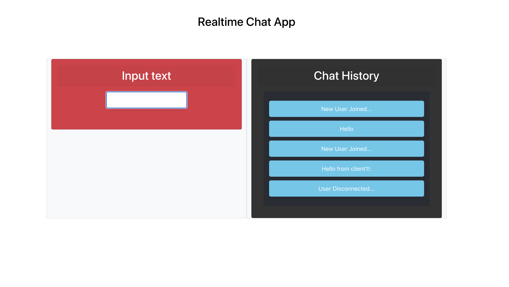

  


# Golang based chat application server and frontend Web App

Project structure:
-  folder `backend`: golang source code and dependencies to deploy a Chat Application Server
-  folder `frontend`: Reactjs front end web app to send and receive real time chat messages
-  folder `utils`: golang based *chat clients* to test and interact with Chat Application Server

## Backend

HTTP and websocket server based in golang

### Frameworks and dependencies

- [Echo](https://pkg.go.dev/github.com/labstack/echo/v4) web framework
- [Gorilla](https://pkg.go.dev/github.com/gorilla/websocket) web socket package
- [Go-kit](https://pkg.go.dev/github.com/go-kit/log) loggin framework
- [Kingpin](https://pkg.go.dev/gopkg.in/alecthomas/kingpin.v2#section-readme) cli framework

### Features

- Multithreading
- Command line options (i.e. `--dev`, `--singleThreaded`, `--help`)
- Loggin levels
- Addon: golang web clients to emulate chat clients
- Addon: docker image

### Usage

- Start server (development)

```bash
> cd backend
> go run main.go --dev --port=8080
```

- Print help

```bash
❯ go run main.go --help
usage: chat-server [<flags>]

A real time multithreading chat application server.

Flags:
  --help                  Show context-sensitive help (also try --help-long and --help-man).
  --log-file=""           write logs to a file
  --dev                   [Insecure] Developer mode
  --ip address=127.0.0.1  Server address.
  --port=8000             Server port number.
  --singleThreaded        [Non-production] Process http request in a single thread
  --version               Show application version.

```

## Frontend

WebApp based in React

### usage

- Start react app (development)

```bash
> cd frontend
> npm start
```

### Web UI



## Testing backend server

- Using ad-hoc automated chat clients

```bash
> cd utils
> go run client1.go -host=127.0.0.1:8080
> go run client2.go -host=127.0.0.1:8080
```

## Live demo

(WIP: *come back soon*)
- Backend: <URL>
- Frontend: <URL>
